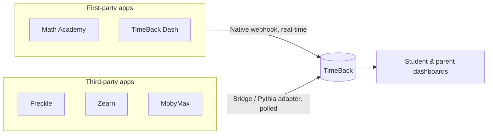

<Info>
  **Internal / staff reference — not parent-facing.** This page explains how the learning apps report data into TimeBack. It is for support, ops, and engineering, and is intentionally more technical than the app support pages under [Learning Apps](/learning-apps/timeback-mdx).
</Info>

## Overview

TimeBack is the **hub**. Every learning app runs on its own, then reports the student's **XP and activity into TimeBack**, which aggregates it into one score and surfaces it on the student and parent dashboards.

Two things follow from this design, and they explain most XP support tickets:

- **XP is not instant** — it lands after the app reports it, which takes anywhere from seconds to minutes depending on _how_ the app connects.
- **A "TimeBack bug" is often an integration timing/reporting issue** in the app-to-TimeBack path, not a TimeBack defect.

## Two integration patterns

<CardGroup cols={2}>
  <Card title="Native webhook (real-time)" icon="bolt">
    **First-party / Alpha-built apps** push data to TimeBack as it happens. XP posts in **under a minute** (often seconds). Examples: Math Academy, TimeBack Dash / PowerPath.
  </Card>

  <Card title="Bridge adapter (polled)" icon="plug">
    **Third-party apps** are read on a schedule through the **TimeBack Bridge (Pythia)**. XP posts after the poll cycle — typically **1–5 minutes**, occasionally longer at peak. Examples: Freckle, Zearn, MobyMax.
  </Card>
</CardGroup>

## The TimeBack Bridge (Pythia)

The **Bridge** is a single authenticated API that connects TimeBack to third-party learning apps. (It is the same integration surfaced by the internal edu-data tooling.)

- **Base URL:** `https://api.timeback-bridge.com`
- **Auth:** Cognito bearer token issued by the org — `Authorization: Bearer <token>`
- **Per-app docs:** `/docs/<app>` (e.g. `/docs/zearn`, `/docs/mobymax`)
- **Capabilities per app:** roster (students/classes), activity data, and progress/placement
- **Covers 11 third-party apps:** Freckle, Lalilo, Anton, Renaissance, Accelerated Reader, MobyMax, Membean, Zearn, Happy Numbers, VocabLoco, Literably

<Info>
  The Bridge covers **third-party apps only**. First-party/Alpha apps (Math Academy, Math Cakes, Math Raiders, AlphaMath, TimeBack Dash) are **not** in the Bridge — they report to TimeBack natively and are tracked by the XP engine. This is why, for example, "Math Cakes" does not appear in the third-party integration list.
</Info>

## App integration matrix

XP delays are from TimeBack's per-app XP rules. The **Source** column marks whether the reporting mechanism is **Confirmed** (the XP rules explicitly state "real-time webhook" or "adapter checks every …") or **Inferred** (derived from the delay and Bridge membership — still to be SME-confirmed).

<Info>
  **Two different axes.** _Webhook vs. adapter_ is a **technical mechanism**; _first- vs third-party_ is a **vendor** distinction. They mostly line up, but not always — so an app's group doesn't guarantee its mechanism.
</Info>

### First-party (Alpha / TimeBack-native)

| App | Reports via | Source | Typical XP delay | Notes |
| --- | --- | --- | --- | --- |
| Math Academy | Native webhook | Confirmed | \< 1 min | XP matches the app exactly; no accuracy threshold |
| TimeBack Dash / PowerPath | Native webhook | Confirmed | \< 10 sec | Science, Psychology, Social Studies |
| Math Raiders (Playcademy) | Native | Inferred | 30–60 sec | Engagement-multiplier XP |
| AlphaMath Fluency (FastMath) | Native | Inferred | \< 1 min | 1 XP/min; \+20% for 100% |
| AlphaNumbers | Native | Inferred | 1–15 min | 1 XP per active minute |
| Math Cakes | Native | Inferred | \< 5 min | Mastery-based; first-party |

### Third-party (via Bridge / Pythia)

| App | Reports via | Source | Typical XP delay | Auth / credentials |
| --- | --- | --- | --- | --- |
| Freckle | Bridge adapter | Confirmed | 2–5 min | Renaissance (shared) |
| Lalilo | Bridge adapter | Confirmed | 1–3 min | Renaissance (shared) |
| Zearn | Bridge adapter (~30s poll) | Confirmed | 1–2 min | Own account connection |
| MobyMax | Bridge adapter (~3 min poll) | Confirmed | 1–3 min | Own account connection |
| Membean | Bridge adapter | Confirmed | 2–5 min | Own account connection |
| Happy Numbers | Bridge adapter | Confirmed | 2–5 min | Own account connection |
| Anton | Bridge adapter | Inferred | 1–3 min | Own account connection |
| VocabLoco | Bridge adapter | Inferred | 1–3 min | Own account connection |
| Accelerated Reader | Bridge | Inferred | — | Renaissance (shared) |
| Renaissance (SIS) | Bridge (rostering) | Confirmed | n/a — identity/roster | Renaissance |
| Literably | Bridge | Inferred | No XP tracking yet | Shared |

## Authentication models

<AccordionGroup>
  <Accordion title="Renaissance family (shared)" icon="id-card">
    Freckle, Lalilo, Renaissance, Accelerated Reader, and Literably authenticate through **Renaissance** using shared credentials (`renaissance_id`, `username`, `password`). No per-student setup — access follows the roster.
  </Accordion>

  <Accordion title="Personal platform connections" icon="key">
    MobyMax, Membean, Zearn, Happy Numbers, VocabLoco, and Anton each require their **own account connection** to be set up before data flows. If a connection is missing or unverified, that app's data won't appear.
  </Accordion>

  <Accordion title="First-party apps" icon="bolt">
    Alpha-built apps report to TimeBack natively — no external credentials in the integration path.
  </Accordion>
</AccordionGroup>

## Verifying what posted

When XP or activity looks wrong, the reporting data is the source of truth:

- `rpt2_daily_activity` — per-student, per-course, per-date XP, goals, accuracy, active minutes.
- `rpt2_activity_log` — per-activity events with lesson names and XP.
- **Accuracy** = `correct_questions / NULLIF(total_questions, 0)`.

If accuracy is below the app's cutoff, `0` XP is expected (app rule). If accuracy meets the cutoff and the delay window has passed but XP is still `0`, it points to an integration/reporting issue. See the [TimeBack "No XP" triage](/learning-apps/timeback-mdx).

<Tip>
  **Confirm before publishing:** the webhook-vs-adapter mechanism per app (inferred here from delays \+ Bridge membership), the exact list of first-party apps, and whether this internal page should ship to the live site or stay internal-only.
</Tip>