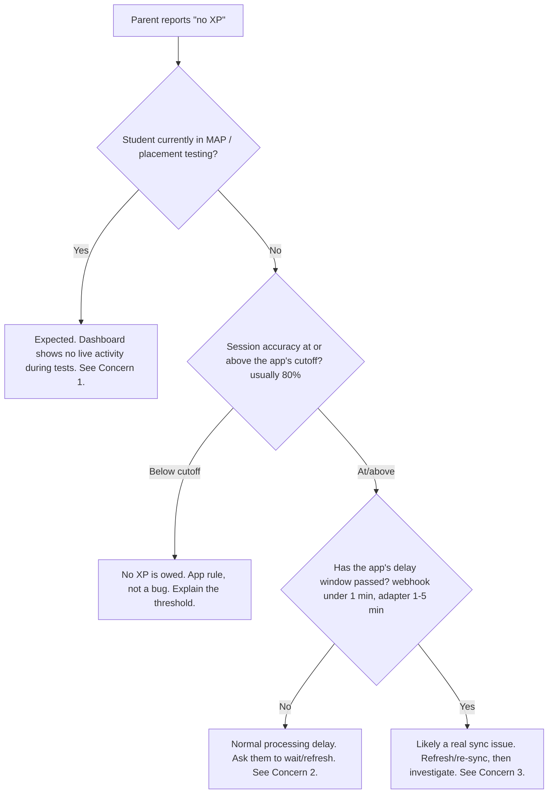

<Note>
  **Scope of this page.** This is the TimeBack entry in the app support library. It covers what TimeBack is, its purpose, how to use the support playbook, and the top concerns **purely associated with TimeBack** — each with resolution steps, a "verify resolved" check, and a ready-to-paste canned response. XP timing and accuracy figures are grounded in TimeBack's per-app XP rules.

  **Owner:** \[Add owner\] · **Last reviewed:** 2026-07-01
</Note>

## What is TimeBack?

TimeBack is the **central platform and hub** of the TSA Online experience. It is not a single learning activity — it is the environment that ties every learning app together and gives students, parents, and staff a single place to work from.

TimeBack has three surfaces that matter for support:

<CardGroup cols={3}>
  <Card title="Student portal" icon="graduation-cap">
    Where students launch their learning apps, see their XP, and join the Daily Academics Call.
  </Card>

  <Card title="Parent portal / dashboard" icon="chart-line">
    Where parents monitor activity, XP, goals, and leaderboards for their child.
  </Card>

  <Card title="TimeBack Mac app" icon="desktop">
    The desktop application some families run, which hosts learning apps and the call environment.
  </Card>
</CardGroup>

## Purpose

TimeBack exists to give one coherent view across many independent learning applications. Concretely, it is responsible for:

- **Aggregating XP** earned across every learning app (TimeBack, MobyMax, Freckle/Renaissance, Math Academy, Zearn, and others) into a single score.
- **Surfacing activity and progress** to parents through the dashboard and leaderboards.
- **Routing students** into their learning apps, placements/MAP testing, and the Daily Academics Call.
- **Managing enrollment, goals, scheduling, and time-off** for each family.

<Info>
  Because TimeBack is the layer that _displays_ XP and activity from every other app, many issues that look like a TimeBack bug are actually about **how and when** other apps report data to it (accuracy thresholds and processing delays). This distinction drives most of the playbook below.
</Info>

## Key terms

<AccordionGroup>
  <Accordion title="XP" icon="star">
    Experience points — the single score TimeBack aggregates from every learning app. Most apps award XP only above an accuracy threshold, and XP posts after an app-specific processing delay.
  </Accordion>

  <Accordion title="MAP (NWEA)" icon="ruler">
    An external diagnostic **screener** used to gauge a student's level. It is not a learning app and is treated as diagnostic. _(Confirm with an SME whether MAP itself posts XP.)_
  </Accordion>

  <Accordion title="Placement / Alpha Test (Mastery Track)" icon="list-check">
    The grade-level and standardized tests that place a student into the right course level. Per TimeBack's XP rules these **do** award XP on completion (e.g., 60–140 XP for a math grade-level test; test-outs earn 2×).
  </Accordion>

  <Accordion title="PowerPath / TimeBack Dash" icon="gauge-high">
    TimeBack's own real-time learning surface (Science, Psychology, Social Studies). XP posts in near real time via webhook.
  </Accordion>

  <Accordion title="Adapter vs. webhook" icon="plug">
    Two ways apps report to TimeBack. **Webhook** apps post in near real time (under a minute). **Adapter** apps are polled on an interval (30 seconds to a few minutes), so their XP lands 1–5 minutes later — occasionally longer at peak.
  </Accordion>
</AccordionGroup>

## How to use the support playbook

Each concern in this library is documented as a consistent, repeatable entry so any agent can resolve it the same way. A complete entry contains:

<AccordionGroup>
  <Accordion title="1. Concern & symptom" icon="triangle-exclamation">
    What the user reports, including **verbatim phrasings** to search on.
  </Accordion>

  <Accordion title="2. Applications involved" icon="grid-2">
    Which app(s) own the issue, with cross-links to related pages.
  </Accordion>

  <Accordion title="3. Root cause" icon="magnifying-glass-chart">
    _Why_ it happens — the underlying rule, delay, or defect.
  </Accordion>

  <Accordion title="4. Resolution steps" icon="list-check">
    The exact, copy-pasteable procedure that resolves it or provides the workaround.
  </Accordion>

  <Accordion title="5. Verify resolved" icon="circle-check">
    How to confirm the fix actually worked before closing the ticket.
  </Accordion>

  <Accordion title="6. Canned response" icon="message-lines">
    A ready-to-paste reply the agent can adapt. Fill in the `[bracketed]` placeholders before sending.
  </Accordion>

  <Accordion title="7. Metadata" icon="tags">
    Frequency, severity, status, last-updated, and owner.
  </Accordion>
</AccordionGroup>

**Severity levels** _(suggested — confirm against your SLA)_:

| Severity | Meaning | Target response |
| --- | --- | --- |
| **High** | Trust risk, cohort-wide, or blocks learning | Same day |
| **Medium** | Individual functional issue with a workaround | Within 1 business day |
| **Low** | Cosmetic or isolated | Best effort |

Two supporting references apply across the whole playbook:

<CardGroup cols={2}>
  <Card title='"Not a bug" explainers' icon="circle-info" href="#not-a-bug-explainers">
    The XP rules and the MAP → Placement → Courses sequence. A large share of tickets are misunderstandings, not defects.
  </Card>

  <Card title="Prevention" icon="shield-check">
    Proactive in-product or email nudges that deflect the ticket before it is raised.
  </Card>
</CardGroup>

## XP quick reference

Most "no XP" tickets are answered by one row of this table: check the app's **accuracy cutoff** and **delay** before assuming a defect. Values come from TimeBack's per-app XP rules.

| App | Accuracy needed | Typical delay | Notes |
| --- | --- | --- | --- |
| Math Academy | None (matches app) | \< 1 min (webhook) | Real-time |
| TimeBack Dash / PowerPath | Per activity | \< 10 sec (webhook) | Science, Psychology, Social Studies |
| Zearn (K–3) | None | ~1–2 min | Multi-activity lesson; "Tower of Power"/"Sprint" alerts can zero specific activities |
| MobyMax | 80% | 1–3 min | Science 13 XP (G3–5), 25 XP (G6–8) |
| Freckle | 80% | 2–5 min | Math K–2: 5, 3–5: 7, 6\+: 10 XP; ELA per correct question |
| Lalilo | 80% | 1–3 min | K–2; lessons span multiple days |
| Membean | 80% (session) | 2–5 min | XP posts at the **end** of the training session |
| Math Cakes | Mastery test pass | \< 5 min | Diagnostic 1 XP/min; perfect score \+1 bonus |
| AlphaNumbers | 80% | 1–15 min | 1 XP per active minute |
| AlphaMath Fluency (FastMath) | 80% | \< 1 min | 1 XP/min; \+20% for 100% |
| Math Raiders (Playcademy) | 80% per raid | 30–60 sec | Engagement multiplier; AFK/idle = 0 XP |
| Alpha Test (Mastery Track) | Test completion | — | Grade-level 60–140 XP (math); test-out = 2× XP |

<Info>
  **Retry & gaming penalties** apply on several apps: reduced XP on 2nd–3rd attempts, and even **negative XP for rushing/guessing** (e.g., AlphaWrite, Edmentum, Nice Academy, Vocabulon). See the app-specific page for exact values. _(Source: TimeBack XP rules.)_
</Info>

## "No XP" triage tree

Use this before anything else when a parent reports missing XP — it routes you to the right concern in seconds.



## "Not a bug" explainers

These two workflows generate a large share of tickets because they are not surfaced in the interface. Link parents here.

<AccordionGroup>
  <Accordion title="How XP is earned (accuracy + delay)" icon="star">
    - XP is awarded per activity, and most apps require **≥80% accuracy** (reading apps 75–80%; a few tests need 90%; Zearn and Math Academy have no threshold). Below the cutoff, **no XP posts at all**.
    - XP is not instant. It posts after an **app-specific delay** — under a minute for real-time apps, 1–5 minutes for most, and occasionally longer at peak.
    - Some apps award **less XP on retries** and **penalize rushing**. A second attempt is worth less than the first.
    - See the [XP quick reference](#xp-quick-reference) for per-app values.
  </Accordion>

  <Accordion title="The MAP → Placement → Courses sequence" icon="arrow-progress">
    New families move through three stages:

    1. **MAP (NWEA) screener** — a diagnostic to gauge level.
    2. **Placement / Alpha tests** — set the correct starting grade per subject. Locked subjects unlock as lower-grade tests are passed (some require ~90%).
    3. **Courses** — daily learning apps, where regular XP and activity begin.

    During stages 1–2 the dashboard is quiet by design: the student is testing, not yet doing daily coursework. Activity and XP fill in once they reach stage 3.
  </Accordion>
</AccordionGroup>

## Top concerns purely associated with TimeBack

Ranked by support impact. Each concern is tagged **User education** (resolved by explanation/procedure) or **Product defect** (needs a product-side fix) so the fixes pass is unambiguous.

| # | Concern | Type | Impact |
| --- | --- | --- | --- |
| 1 | Parent dashboard shows "no activity / 0 XP" while the student is working | User education | High — trust risk |
| 2 | XP appears only after a processing delay, read as a malfunction | User education | High — highest volume |
| 3 | Completed work shows as "incomplete" on the dashboard | Product defect | Medium |
| 4 | Leaderboard shows 0 XP or the wrong student | Product defect | High — trust risk |
| 5 | TimeBack Mac app conflicts with Zoom (blocks camera/video) | Product defect | High — cohort-wide 6/29 |
| 6 | Time-off calendar defect (wrong weekday; date picker won't select) | Product defect | Low |
| 7 | Accessibility gap — no built-in text-to-speech (Speechify not installed) | Product defect | Medium |
| 8 | Enrollment / start-date errors | Product defect | Medium |

---

### 1. Parent dashboard shows "no activity / 0 XP" while the student is working

<Warning>
  **Trust risk.** When the dashboard reads as empty during testing, some parents interpret it as the platform — or "the AI learning" — not working. This is actively reducing confidence for new families. See [tone guidance](#tone-for-trust-risk-replies).
</Warning>

- **Type:** User education
- **Applications:** TimeBack (parent portal), Leaderboards
- **Symptom / verbatim:**
  - _"Eli is on his, showing not active, no XP — doesn't he earn that on MAP?"_ — Kimberly Collier `[6/29]`
  - _"I don't see that he is active; I want to make sure he's doing what he's supposed to."_ — Maria Mullins `[6/29]`
  - _"Rozalyn has been logged in since 9am but shows no activity on my dashboard."_ — Adelle Loock `[6/29]`
- **Root cause:** The student is completing **MAP / placement testing**. The dashboard shows no live "active" status during a test, and any XP from a completed test posts only after a processing delay — so a quiet dashboard mid-testing is expected, not a malfunction. _Note: Alpha placement / mastery tests **do** award XP on completion; the MAP (NWEA) screener is diagnostic. Confirm with an SME whether MAP itself posts XP before finalizing this page._

**Resolution steps**

<Steps>
  <Step title="Confirm the student is in MAP or placement testing">
    Check whether the child is currently logged in and which activity they are in. Active MAP or placement testing is the expected cause.
  </Step>
  <Step title="Reassure the parent this is expected">
    While a test is in progress the dashboard does not show live "active" status, and test XP posts only after completion plus a processing delay. A quiet dashboard here is normal, not a malfunction.
  </Step>
  <Step title="Set the expectation for when data appears">
    Explain that activity and XP fill in on the dashboard once placements are complete and the student begins their courses (see [the MAP → Placement → Courses sequence](#not-a-bug-explainers)).
  </Step>
  <Step title="Rule out a real gap">
    If the student is **not** testing (already in courses) and still shows nothing after the app's delay window, treat it as the XP processing delay ([Concern 2](#2-xp-appears-only-after-a-processing-delay)) or a sync issue ([Concern 3](#3-completed-work-shows-as-incomplete-on-the-dashboard)).
  </Step>
</Steps>

**Verify resolved:** The parent understands testing is in progress, or — if the student is in courses — activity/XP appears after a refresh once the delay window passes.

**Canned response**

```text
Hi [Parent name], thanks for reaching out! I checked on [Student] — they're
currently working through their MAP / placement testing. While a test is in
progress the dashboard doesn't show a live "active" status, and any XP from a
completed test takes a little while to post, so a quiet dashboard right now is
expected rather than a sign that anything's wrong. Once [Student] finishes
placements and moves into their daily courses, you'll see activity and XP start
filling in. I'll keep an eye on it — please reach back out if it still looks
empty tomorrow!
```

**Metadata:** ~6 parents, concentrated 6/29 · Severity **High**

### 2. XP appears only after a processing delay

- **Type:** User education
- **Applications:** TimeBack (XP display)
- **Symptom:** Work is finished but XP does not appear immediately; the platform is assumed to be broken.
- **Root cause:** Normal XP **processing delay**, which is **app-specific** and not surfaced in the interface. Real-time (webhook) apps such as Math Academy and TimeBack Dash post in under a minute; most adapter-based apps take **1–5 minutes**; a few are slower (AlphaNumbers 1–15 min, ClearFluency up to ~100 min at peak). Frequently compounds with the accuracy rule most learning apps enforce. _(Source: TimeBack XP rules.)_

**Resolution steps**

<Steps>
  <Step title="Confirm the work was completed">
    Verify the student actually finished the activity in the learning app.
  </Step>
  <Step title="Check the accuracy threshold">
    Most learning apps only award XP at **≥80% accuracy** — but it varies: reading apps 75–80%, eGumpp and Astro Math mastery need 90%, and **Zearn and Math Academy have no threshold**. If accuracy fell below the app's cutoff, no XP posts at all — that is the app rule, not the delay. See the [XP quick reference](#xp-quick-reference).
  </Step>
  <Step title="Explain the processing delay">
    If accuracy was met, explain that XP posts after a short **app-specific** delay — under a minute for real-time apps, usually **1–5 minutes** otherwise, and occasionally longer for a few apps at peak times.
  </Step>
  <Step title="Ask them to refresh after the delay window">
    Have the student or parent refresh the dashboard once the app's delay window has passed.
  </Step>
  <Step title="Escalate if still missing">
    If XP is still absent after the delay window with accuracy at/above the cutoff, treat it as a sync issue ([Concern 3](#3-completed-work-shows-as-incomplete-on-the-dashboard)).
  </Step>
</Steps>

**Verify resolved:** XP appears on the dashboard within the app's delay window after a refresh.

**Canned response**

```text
Hi [Parent name], good news — [Student]'s work went through and no XP is lost!
XP isn't always instant; the timing depends on the app. Some post in under a
minute, while others take a few minutes (and a couple can take a bit longer at
busy times) to appear on the dashboard. One thing worth knowing: most apps only
award XP when accuracy is high enough (usually 80%+), so if a session came in
below that, it won't add XP. If it's been more than [X] minutes and you still
don't see it, reply with the app name and I'll take a closer look.
```

**Metadata:** Highest-volume theme · Severity **High**

### 3. Completed work shows as "incomplete" on the dashboard

- **Type:** Product defect (to confirm)
- **Applications:** TimeBack (dashboard sync)
- **Symptom / verbatim:** Noam Benloulou — math completed in the app, but the TimeBack dashboard showed it as incomplete.
- **Root cause:** Suspected sync gap between the learning app's completion state and the TimeBack dashboard. Distinguish from [Concern 2](#2-xp-appears-only-after-a-processing-delay) (delay) during triage.

**Resolution steps**

<Steps>
  <Step title="Rule out the processing delay">
    Confirm the app's delay window has passed since completion (see [Concern 2](#2-xp-appears-only-after-a-processing-delay)).
  </Step>
  <Step title="Rule out the accuracy threshold">
    Confirm the activity was completed at or above the app's accuracy cutoff, so XP was actually due.
  </Step>
  <Step title="Refresh and re-sync">
    Have the student log out and back in, then reload the dashboard to force a re-sync.
  </Step>
  <Step title="Confirm against the data (optional)">
    If you have data access, verify the activity actually posted (see [How to verify a student's XP](#how-to-verify-a-students-xp)).
  </Step>
</Steps>

**Verify resolved:** The activity shows as complete after re-sync, or the data confirms whether it posted.

**Canned response**

```text
Hi [Parent name], thanks for flagging this. [Student]'s [app] work should
count — sometimes the dashboard just needs a moment to sync after a lesson
finishes. Could you have [Student] log out and back in, then refresh the
dashboard? That usually pulls in the latest status. If it still shows
incomplete after that, reply here with the lesson name and roughly when it was
finished, and I'll look into it further.
```

**Metadata:** Isolated reports · Severity **Medium**

### 4. Leaderboard shows 0 XP or the wrong student

<Warning>
  **Trust risk.** Explicitly cited as lowering a parent's confidence in the AI learning. See [tone guidance](#tone-for-trust-risk-replies).
</Warning>

- **Type:** Product defect
- **Applications:** TimeBack (Leaderboards)
- **Symptom / verbatim:** Khadija El-Amin — leaderboard showed Zyana at zero and Jerry mismatched; _"lowers my confidence in the AI learning."_ Related: students missing from the XP planner or goals appearing too low (Melanie / Melissa / Abraham).
- **Root cause:** Suspected leaderboard/XP-planner data accuracy issue.

**Resolution steps**

<Steps>
  <Step title="Confirm the discrepancy">
    Compare the student's actual XP in their profile against the leaderboard / XP-planner figure to confirm the mismatch is real. If you have data access, verify against the source (see [How to verify a student's XP](#how-to-verify-a-students-xp)).
  </Step>
  <Step title="Refresh the view">
    Reload the leaderboard and dashboard; transient render errors sometimes clear on their own.
  </Step>
  <Step title="Reassure the parent XP is safe">
    Explain that earned XP is recorded on the student's account even when the leaderboard misrenders — the score itself is not lost.
  </Step>
</Steps>

**Verify resolved:** The leaderboard matches the student's actual XP after refresh, or the true XP is confirmed intact in the data.

**Canned response**

```text
Hi [Parent name], thanks for pointing this out, and I completely understand the
concern. Please rest assured that [Student]'s earned XP is safely recorded on
their account — the leaderboard occasionally shows a stale or mismatched number
even when the underlying XP is correct. I've confirmed [Student]'s actual XP is
intact. A refresh often clears the display, and I'm flagging the leaderboard so
it's corrected. Thank you for your patience!
```

**Metadata:** Severity **High** (trust)

### 5. TimeBack Mac app conflicts with Zoom

- **Type:** Product defect
- **Applications:** TimeBack Mac app (conflicts with Zoom)
- **Symptom / verbatim:** Adelle Loock `[6/29]` — TimeBack blocked Zoom video; the Daily Academics Call was only accessible after closing TimeBack.
- **Root cause:** The TimeBack Mac app and Zoom contend for the camera/video window.

**Resolution steps**

<Steps>
  <Step title="Close the TimeBack Mac app">
    Fully quit the TimeBack desktop app before joining the Daily Academics Call.
  </Step>
  <Step title="Join Zoom directly">
    Open the call in Zoom and confirm the camera/video now enables.
  </Step>
</Steps>

**Verify resolved:** The camera enables and the student can join the call with TimeBack closed.

**Canned response**

```text
Hi [Parent name], sorry for the trouble joining the call! This is a known
conflict between the TimeBack Mac app and Zoom over the camera. The quick fix:
fully quit the TimeBack desktop app, then open and join the Daily Academics Call
in Zoom — the camera should enable normally. You can reopen TimeBack after the
call. Let me know if that gets [Student] in!
```

**Metadata:** Surfaced during the cohort-wide 6/29 call issues · Severity **High**

### 6. Time-off calendar defect

- **Type:** Product defect
- **Applications:** TimeBack (time-off calendar)
- **Symptom / verbatim:** Adelle Loock `[6/29]` — the July calendar showed the wrong weekday, and the date picker would not select a date.
- **Root cause:** Calendar rendering / date-picker defect.

**Resolution steps**

<Steps>
  <Step title="Confirm the defect">
    Reproduce it: check whether the weekday is misaligned and whether the date picker accepts a selection.
  </Step>
  <Step title="Offer an interim path">
    If the parent needs to submit time-off now, capture the requested dates and enter or confirm them manually on their behalf.
  </Step>
</Steps>

**Verify resolved:** The requested time-off is recorded (manually if needed) and the parent has confirmation.

**Canned response**

```text
Hi [Parent name], thanks for reporting the calendar issue. We're aware the
time-off calendar can display the wrong weekday and that the date picker
sometimes won't respond. So you're not held up, please reply with the exact
dates you'd like to request and I'll enter the time-off for you directly while
the display issue is being fixed.
```

**Metadata:** Isolated · Severity **Low**

### 7. Accessibility gap — no built-in text-to-speech

- **Type:** Product defect / gap
- **Applications:** TimeBack (Speechify integration)
- **Symptom / verbatim:** Adelle Loock `[6/29]` — Speechify (for a child with dyslexia) is not installed, and there is no built-in text-to-speech.
- **Root cause:** Missing accessibility tooling in the TimeBack environment.

**Resolution steps**

<Steps>
  <Step title="Acknowledge the need">
    Confirm the accessibility requirement (e.g., text-to-speech for dyslexia support) and flag it as a priority.
  </Step>
  <Step title="Offer an interim option">
    Point the family to a stopgap such as the browser's or operating system's built-in read-aloud until Speechify is available. _\[Confirm approved interim tool.\]_
  </Step>
</Steps>

**Verify resolved:** The family has a working read-aloud option in the meantime and the request is logged.

**Canned response**

```text
Hi [Parent name], thank you for letting us know about [Student]'s need for
text-to-speech — I completely understand how important this is. A built-in
read-aloud isn't available in TimeBack just yet, so in the meantime you can use
[interim tool] to have on-screen text read aloud. I'm also flagging the request
so we can support this properly. Please don't hesitate to reach out if [Student]
needs anything else in the meantime.
```

**Metadata:** Isolated but high individual impact · Severity **Medium**

### 8. Enrollment / start-date errors

- **Type:** Product defect
- **Applications:** TimeBack (enrollment)
- **Symptom / verbatim:**
  - Heather — incorrect enrollment SMS.
  - Patricia — start date pushed to August unexpectedly.
  - Henry — returning-student accounts disabled.
- **Root cause:** Enrollment/account provisioning errors.

**Resolution steps**

<Steps>
  <Step title="Verify the account record">
    Look up the student's enrollment record and confirm the correct details (contact info, start date, account status).
  </Step>
  <Step title="Correct what you can">
    For known-good corrections (e.g., fixing a start date, re-enabling a returning student), apply the fix.
  </Step>
</Steps>

**Verify resolved:** The record shows the correct start date / active status and the parent has confirmation.

**Canned response**

```text
Hi [Parent name], thanks for reaching out about [Student]'s enrollment. Let me
get this sorted — I'm confirming the details on our end (start date, contact
info, and account status). [I've corrected [X] / I'll update this and follow up
shortly.] You should see the change reflected [timeframe]. Apologies for the
mix-up, and thank you for your patience!
```

**Metadata:** Scattered · Severity **Medium**

---

## Known issues / status board

Check here before investigating — some issues are already fixed. _Statuses need confirmation with the product team._

| Issue | Status | Notes |
| --- | --- | --- |
| Zoom camera fails to enable (6/29 cohort-wide) | ✅ Resolved | Server-side fix applied |
| TimeBack Mac app ↔ Zoom camera conflict | 🟡 Open | Workaround: close TimeBack before joining (Concern 5) |
| Dashboard shows completed work as "incomplete" | 🔍 Investigating | Suspected sync gap (Concern 3) |
| Leaderboard / XP-planner mismatch | 🔍 Investigating | Underlying XP believed intact (Concern 4) |
| Time-off calendar wrong weekday / date picker | 🟡 Open | Manual entry workaround (Concern 6) |
| Built-in text-to-speech / Speechify | 📋 Planned | Not yet available (Concern 7) |

## How to verify a student's XP

<Info>
  This requires data access. If front-line support does not have it, treat this as an internal/escalation reference rather than a front-line step.
</Info>

To confirm whether XP actually posted (rather than just reassuring), check the reporting data:

- **Per day / per course:** `rpt2_daily_activity` — `earned_xp`, `xp_goal`, `correct_questions`, `total_questions`, `active_minutes`.
- **Per activity (with lesson names):** `rpt2_activity_log` — `earned_xp`, `activity_name`, `event_time`.
- **Accuracy check:** `correct_questions / NULLIF(total_questions, 0)` — compare against the app's cutoff in the [XP quick reference](#xp-quick-reference).

If XP is `0` and accuracy is below the cutoff, it is the app rule (not a bug). If accuracy is above the cutoff and the delay window has passed but XP is still `0`, it is a genuine sync issue worth flagging.

## Tone for trust-risk replies

For the trust-risk concerns (1 and 4), how you say it matters as much as the fix:

- **Lead with reassurance** that XP/progress is safe and recorded — before explaining the mechanics.
- **Don't over-promise.** For open defects, say it's "being looked into," not "fixed."
- **Confirm, don't dismiss.** "I've checked and \[Student\]'s XP is intact" beats "that's just a display glitch."
- **Close the loop.** Offer to follow up so the parent isn't left watching a broken-looking screen.

<Tip>
  **Next pass:** confirm the open placeholders — the MAP-XP question (Concern 1), the interim read-aloud tool (Concern 7), the known-issue statuses, and whether front-line support has data access for XP verification.
</Tip>